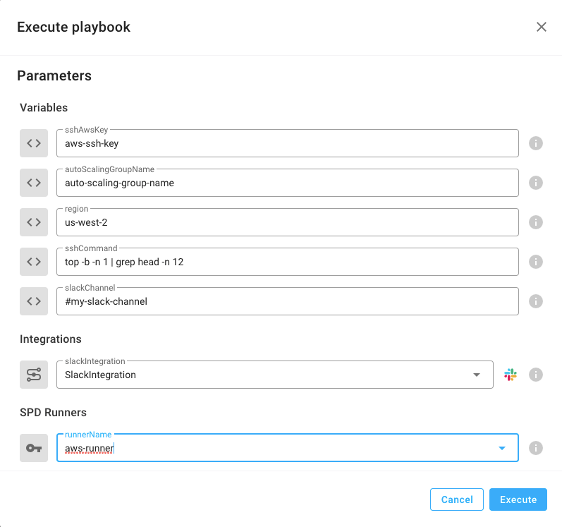

# AWS Auto Scaling Group Execute Command

This playbook executes a command on each instance of an AWS Auto Scaling Group and and then verifies its health.

## Your benefits

- Retrieve all instances of an AWS Auto Scaling Group and execute a remediation command on each one
- Get health metrics for a given AWS Auto Scaling Group

## Your experience

### Parameters

### Result

## How to get started

Not a StackPulse user? Follow these steps:

1. Make sure your have a [StackPulse](https://stackpulse.com/get-started) account
2. Configure a  new [Slack integration](https://docs.stackpulse.io/getting_started/#step-3-configure-a-new-slack-integration)
3. Set up your AWS authentication process-
    a. Remote SPD with dedicated AWS role.
    b. Using AWS integrarion.
    c. Using AWS user tokens.
4. Import [this playbook](https://app.stackpulse.io/playbooks) into your account
5. Connect it to monitoring alerts or execute manually
