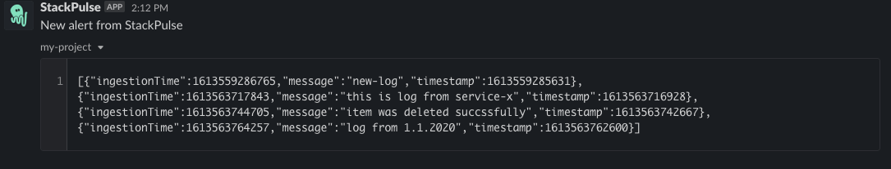

# Retrieve Cloudwatch Logs

This playbook fetch the latest Cloudwatch logs using aws-cli, given region, group-name and stream-name. Then, notify the relevant stackholders using slack.

## Your benefits

- Get recent Cloudwatch logs given region, group name and stream-name
- Limit your max count of desirable logs
- Send and notify the relevant stackholders using slack

## Your experience

## How to get started

Not a Stackpulse user? Follow these steps:

1. Make sure your have a [StackPulse](https://stackpulse.com/get-started) account
2. Configure a  new [Slack integration](https://docs.stackpulse.io/getting_started/#step-3-configure-a-new-slack-integration)
3. Choose one of the following methods to authenticate your AWS cloud provider: 
    a. Using aws api keys - with StackPulse custom secrets - password in [Custom Secrets](https://docs.stackpulse.io/integrations/#custom-integrations-secrets)  
    b. StackPulse aws integration 
    c. Configure remote spd runner with the desire roles  
4. Import [this playbook](https://app.stackpulse.io/playbooks) into your account
5. Connect it to monitoring alerts or execute manually
