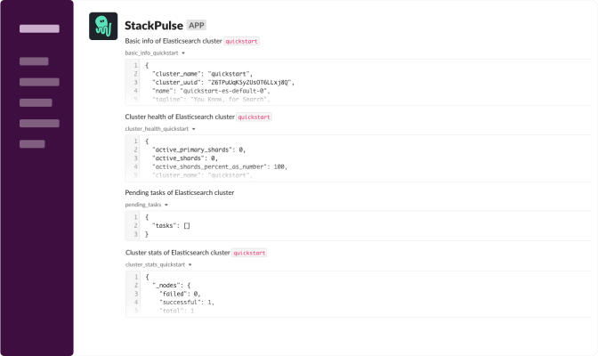

# Elasticsearch Get Stats

This playbook collects info, stats and metrics from an Elasticsearch cluster and sends it to Slack.

## Your benefits

- Get basic info about your Elasticsearch
- Get cluster level health metrics and stats
- Get node level usage metrics and stats
- Easily retrieve and share this information as a Slack snippet

## Your experience

## How to get started

Not a StackPulse user? Follow these steps:

1. Make sure your have a [StackPulse](https://stackpulse.com/get-started) account
2. Configure a  new [Slack integration](https://docs.stackpulse.io/getting_started/#step-3-configure-a-new-slack-integration)
3. Set up your Elastic password in [Custom Secrets](https://docs.stackpulse.io/integrations/#custom-integrations-secrets)
4. Import [this playbook](https://app.stackpulse.io/playbooks) into your account
5. Connect it to monitoring alerts or execute manually
