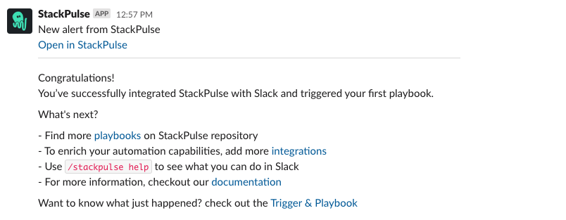

# Hello World Slack

This playbook demonstrates basic StackPulse automation. 

## Your benefits

- Automate your first playbook in StackPulse
- Learn of StackPulse fundamental terms, flow and usage

## Your experience

## How to get started

Not a Stackpulse user? Follow these steps:

1. Make sure your have a [StackPulse](https://stackpulse.com/get-started) account
2. Configure a  new [Slack integration](https://docs.stackpulse.io/getting_started/#step-3-configure-a-new-slack-integration)
3. Import [this playbook](https://app.stackpulse.io/playbooks) into your account
4. Connect it to monitoring alerts or execute manually
