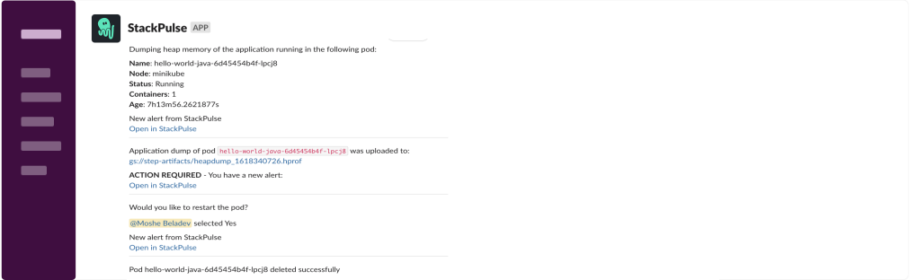

# Kubernetes Java Memory Dump

This playbook perform memory dump of application running in a Kubernetes pod, upload it to cloud storage and send the summary along with the option to restart the pod directly from Slack.

## Your benefits

- Get heap dump of your Java application without setup or orchestrate the tooling by yourself
- Auto save the dump file in a cloud storage bucket and track it on a Slack channel
- Option to restart the pod directly from Slack without accessing the cluster

## Your experience

## How to get started

Not a Stackpulse user? Follow these steps:

1. Make sure your have a [StackPulse](https://stackpulse.com/get-started) account
2. Configure a  new [Slack integration](https://docs.stackpulse.io/getting_started/#step-3-configure-a-new-slack-integration)
3. Deploy an [SPD (StackPulse Daemon)](https://docs.stackpulse.io/spds/) in your Kubernetes Cluster
4. Import [this playbook](https://app.stackpulse.io/playbooks) into your account
5. Connect it to monitoring alerts or execute manually
