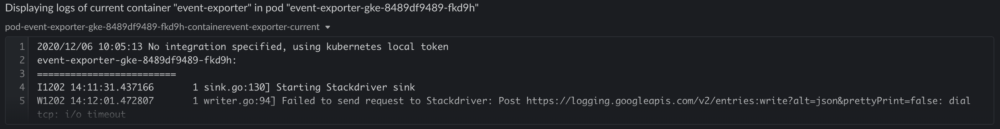

# Kubernetes Pod Restarting Diagnostics

This playbook solves consistent Pod Restarting events in a Kubernetes cluster.
It gets the latest started pods in the namespace provided either by alert or by the user, then gets the current and previous (if exists) logs of the relevant container.

## Your benefits

- Get the current and previous logs of a container, which can easily point directly to the root cause
- Provide information from production Kubernetes clusters without having to provide multiple people direct access to production
- Assist engineers to handle production issues by getting a wider context regardless of their Kubernetes expertise level

## Your experience

## How to get started

Not a Stackpulse user? Follow these steps:

1. Make sure your have a [StackPulse](https://stackpulse.com/get-started) account
2. Configure a  new [Slack integration](https://docs.stackpulse.io/getting_started/#step-3-configure-a-new-slack-integration)
3. Deploy an [SPD (StackPulse Daemon)](https://docs.stackpulse.io/spds/) in your Kubernetes Cluster
4. Import [this playbook](https://app.stackpulse.io/playbooks) into your account
5. Connect it to monitoring alerts or execute manually
