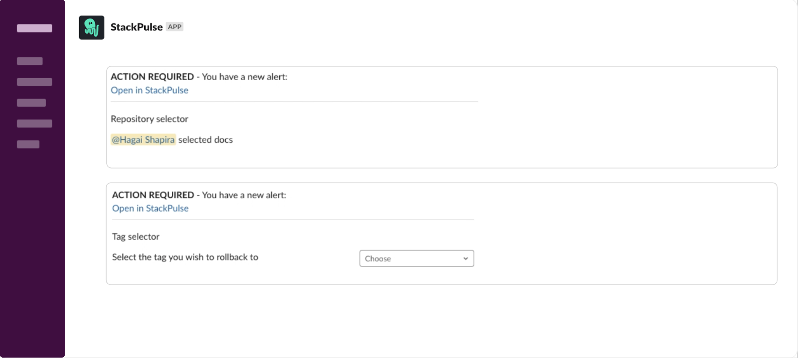

# Kubernetes Rollback

This playbook enables an operator to easily and properly rollback a Kubernetes deployment using a GitOps FluxCD. Executing the playbook will interactively retrieve the list of services to the user and then the commit history for the selected service. Once the correct target tag is chosen, the playbook continues to safely rollback the service and lock the CD pipeline.

## Your benefits

- Allow safe service rollbacks in a guided manner that provides operators with the confidence and the ability to rapidly resolve application code related incidents
- Provide the service recent commit history to help establish the target tag to rollback to
- Automatic Continuos Deployment pipeline locking prevents further deployments until a fix is issued
- Reduce the need for expert level knowledge of the Kubernetes CLI and the Continuous Deployment pipeline details
- Verify a successful rollback using a follow up `get pods` command

## Your experience

## How to get started

> :warning: **Note**: This playbook assumes the use of git tags/releases in repositories organized by service to manage Kubernetes deployments. It also makes assumptions about the FluxCD endpoint (see `FLUX_URL` in the playbook).
>
> If you need assistance in integrating this playbook reach out to [StackPulse support](mailto:support@stackpulse.io).

Not a StackPulse user? Follow these steps:

1. Make sure your have a [StackPulse](https://stackpulse.com/get-started) account
2. Configure a  new [Slack integration](https://docs.stackpulse.io/getting_started/#step-3-configure-a-new-slack-integration)
3. Deploy an [SPD (StackPulse Daemon)](https://docs.stackpulse.io/spds/) in your Kubernetes Cluster
4. Import [this playbook](https://app.stackpulse.io/playbooks) into your account
5. Connect it to monitoring alerts or execute manually
