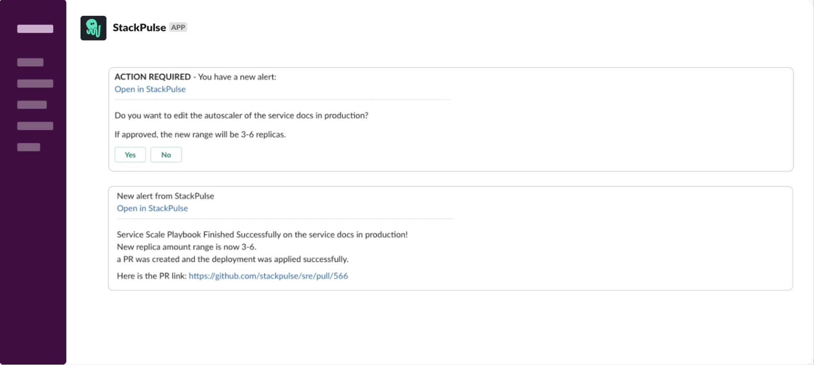

# Kubernetes Service Scale

This playbook enables an operator to easily and safely scale a service deployment by changing Kubernetes Horizontal Pod Autoscaler (HPA) settings. Executing the playbook will get the new HPA range from the user and issue both the scale command and create a pull request to solidify the change in a GitOps repo.

## Your benefits

- Allow safe service scaling in a guided manner that provides operators with the confidence and the ability to rapidly resolve resource quota hits and exhaustion
- Have an automatically created pull request to your GitOps pipeline for future deployments and as an audit for approval

## Your experience

## How to get started

> :memo: **Note**: This playbook makes assumptions about the directory structure of your Kubernetes resources (see `FILE_PATH` in the playbook).
>
> If you need assistance in integrating this playbook reach out to [StackPulse support][mailto:support@stackpulse.io].

Not a StackPulse user? Follow these steps:

1. Make sure your have a [StackPulse](https://stackpulse.com/get-started) account
2. Configure a  new [Slack integration](https://docs.stackpulse.io/getting_started/#step-3-configure-a-new-slack-integration)
3. Deploy an [SPD (StackPulse Daemon)](https://docs.stackpulse.io/spds/) in your Kubernetes Cluster
4. Import [this playbook](https://app.stackpulse.io/playbooks) into your account
5. Connect it to monitoring alerts or execute manually
