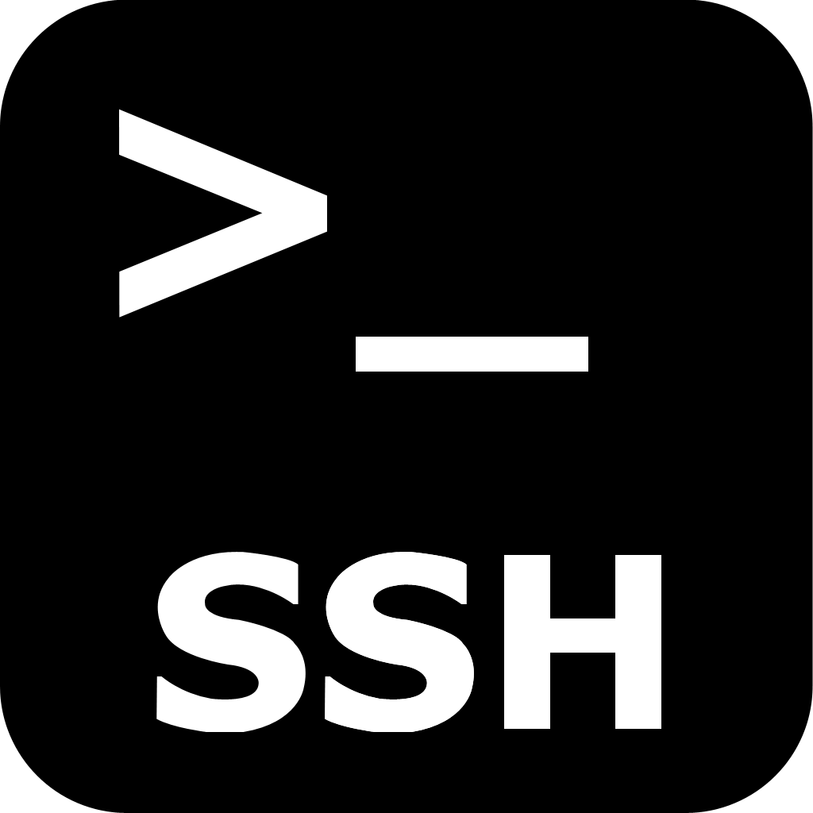
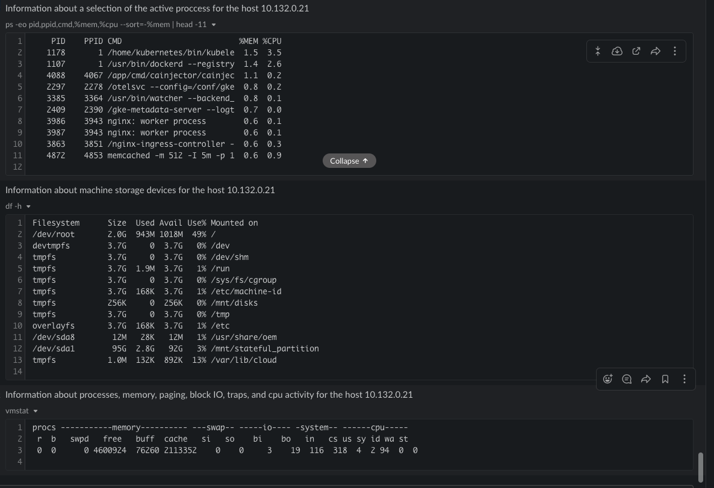

# Local Diagnostics

This playbook queries utilization of CPU, memory and storage for a given host and sends the output to Slack recipients of choice.

## Your benefits

- Triage production hosts without having to provide multiple people direct access to production.

## Your experience

## How to get started

Not a Stackpulse user? Follow these steps:

1. Make sure your have a [StackPulse](https://stackpulse.com/get-started) account
2. Configure a  new [Slack integration](https://docs.stackpulse.io/getting_started/#step-3-configure-a-new-slack-integration)
3. Set up your private key as a [Custom Secret](https://docs.stackpulse.io/integrations/#custom-integrations-secrets)
4. Import [this playbook](https://app.stackpulse.io/playbooks) into your account
5. Connect it to monitoring alerts or execute manually
