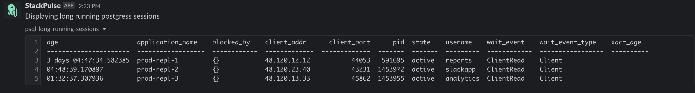

# Postgres Long Running Sessions

This playbook collects all non-idle long running sessions from PostgresSQL instance and send it to Slack recipients.

## Your benefits

- Quickly identify long running sessions which can cause performance overheads
- Initiate triage by finding the applications which running the long sessions queries
- Provide information from production PostgresSQL instance without having to provide multiple people direct access to production
- Assist engineers to handle production issues by getting wider context regardless of their PostgresSQL expertise level

## Your experience

## How to get started

Not a Stackpulse user? Follow these steps:

1. Make sure your have a [StackPulse](https://stackpulse.com/get-started) account
2. Configure a  new [Slack integration](https://docs.stackpulse.io/getting_started/#step-3-configure-a-new-slack-integration)
3. Deploy an [SPD (StackPulse Daemon)](https://docs.stackpulse.io/spds/) in your Kubernetes Cluster
4. Import [this playbook](https://app.stackpulse.io/playbooks) into your account
5. Connect it to monitoring alerts or execute manually
