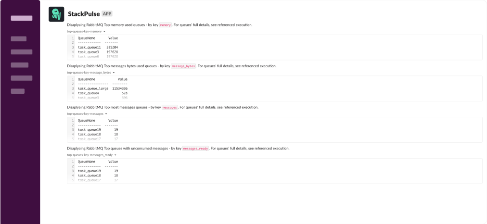
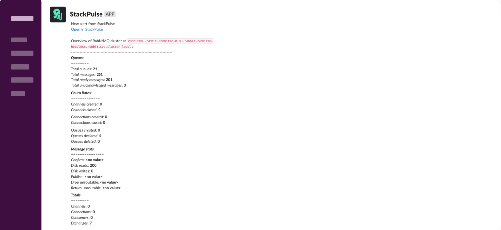

# RabbitMQ Queues Overview

This playbook collects an overview about RabbitMQ instance and classify it's most consumption queues by: `messages`, `unacknowledged messages`, `messages bytes` and `memory` and send it to Slack recipients.

## Your benefits

- Quickliy identify the most consumption queues
- Get a quick overview over your RabbitMQ instance
- Provide information from production RabbitMQ instance without having to provide multiple people direct access to production
- Assist engineers to handle production issues by getting a wider context regardless of their RabbitMQ expertise level

## Your experience

## How to get started

Not a Stackpulse user? Follow these steps:

1. Make sure your have a [StackPulse](https://stackpulse.com/get-started) account
2. Configure a  new [Slack integration](https://docs.stackpulse.io/getting_started/#step-3-configure-a-new-slack-integration)
3. Deploy an [SPD (StackPulse Daemon)](https://docs.stackpulse.io/spds/) in your Kubernetes Cluster
4. Import [this playbook](https://app.stackpulse.io/playbooks) into your account
5. Connect it to monitoring alerts or execute manually
