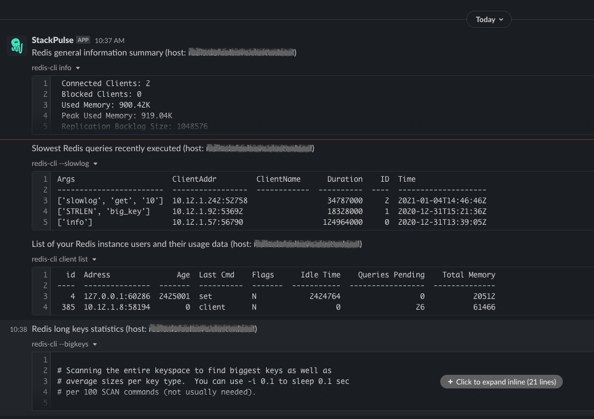

# Redis Diagnostics

This playbook queries a Redis host's general and specific diagnostics:

* General Info: Basic triage such as number of connected clients, memory consumption, server uptime, etc.
* Slow Logs: Last X (default: 10) slowest queries executed.
* Client List: Allows you to quickly understand who use (or abuse) your Redis instance. The list of clients is ordered by id and include name, adress and flags, as well as last command executed, total memory consumed, number of pending queries, idle time and more.
* Big Keys: Retrieves statistics about keys size in your Instance, and their memory consumption.

At the end of each step, its output is sent to Slack recipients of your choice.

## Your benefits

* Automatically retrieve an overview of your Redis instance diagnostics.

## Your experience

## How to get started

Not a Stackpulse user? Follow these steps:

1. Make sure your have a [StackPulse](https://stackpulse.com/get-started) account
2. Configure a  new [Slack integration](https://docs.stackpulse.io/getting_started/#step-3-configure-a-new-slack-integration)
3. Set up your Redis password as a [Custom Secret](https://docs.stackpulse.io/integrations/#custom-integrations-secrets)
4. Import [this playbook](https://app.stackpulse.io/playbooks) into your account
5. Connect it to monitoring alerts or execute manually
