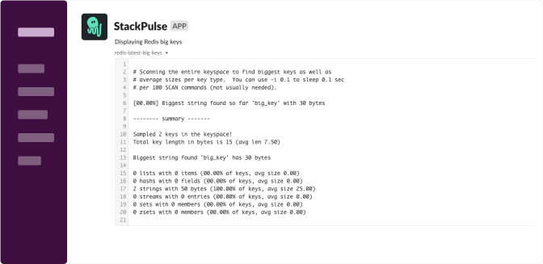

# Redis Get Big Keys

This playbook queries a Redis host and retrieves the current big keys.
It then sends that output to Slack recipients of your choice as a snippet.

## Your benefits

- Automatically retrieve big keys of a Redis instance to triage memory and performance-related issues.

## Your experience

## How to get started

Not a Stackpulse user? Follow these steps:

1. Make sure your have a [StackPulse](https://stackpulse.com/get-started) account
2. Configure a  new [Slack integration](https://docs.stackpulse.io/getting_started/#step-3-configure-a-new-slack-integration)
3. Set up your Redis password as a [Custom Secret](https://docs.stackpulse.io/integrations/#custom-integrations-secrets)
4. Import [this playbook](https://app.stackpulse.io/playbooks) into your account
5. Connect it to monitoring alerts or execute manually
