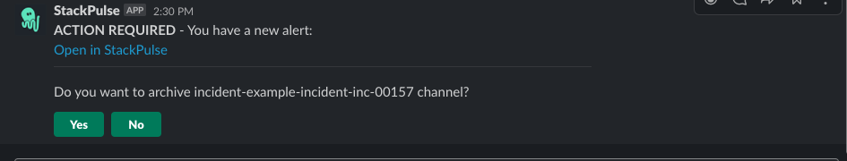

# StackPulse Archive Incident War Room

This playbook interactively asks the incident commander whether to archive the incident's war room channel.
The default behavior after a timeout of five minuets will be to archive the channel.
This playbook should be triggered by an incident update event with a closed status.

## Your benefits

- Keep Slack workspace uncluttered with closed incident's war room channels and streamline your incident closure flow.

## Your experience

## How to get started

Not a Stackpulse user? Follow these steps:

1. Make sure your have a [StackPulse](https://stackpulse.com/get-started) account
2. Configure a  new [Slack integration](https://docs.stackpulse.io/getting_started/#step-3-configure-a-new-slack-integration)
3. Import [this playbook](https://app.stackpulse.io/playbooks) into your account
4. This playbook has a default trigger attached to it. It will be triggered when a status of an incident will be updated to 'Resolved' or 'Closed'.
> :memo: Note: If your account is missing one of the required integrations, or has multiple instances of an integration, go to the `TRIGGER` tab to select the required ones.