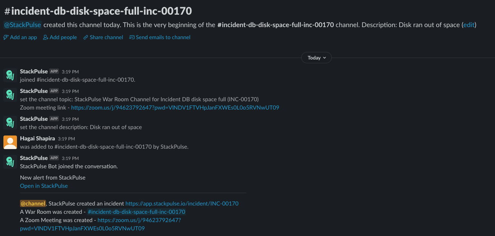

# StackPulse Create Incident War Room

This playbook opens a new Slack channel to be used as a war room for a new incident.
It additionally creates a Zoom call and pages the current on caller on OpsGenie at the time of the incident.
This playbook should be set up to be triggered by an incident creation event.

## Your benefits

- Coordinate all parties involved in an incident faster with on demand war room channel and Zoom meeting creation.
- Seamlessly page your on caller with the creation of a StackPulse incident.

## Your experience

## How to get started

Not a Stackpulse user? Follow these steps:

1. Make sure your have a [StackPulse](https://stackpulse.com/get-started) account
2. Configure a new [Slack integration](https://docs.stackpulse.io/getting_started/#step-3-configure-a-new-slack-integration)
3. Configure a new [OpsGenie integration](https://docs.stackpulse.io/integrations/#opsgenie)
4. Set up your Zoom API keys as [Custom Secrets](https://docs.stackpulse.io/integrations/#custom-integrations-secrets)
5. Import [this playbook](https://app.stackpulse.io/playbooks) into your account
6. Connect it to be triggered by incident creation events
