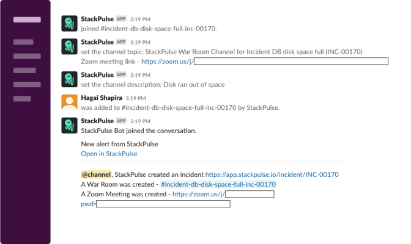

# StackPulse Create Incident War Room

This playbook opens a new Slack channel to be used as a war room when an incident is created.

## Your benefits

- Coordinate all incident stakeholders faster with on demand war room channel.
- Configurable invitees list allows to invite relevant participants per use case.

## Your experience

## How to get started

Not a Stackpulse user? Follow these steps:

1. Make sure your have a [StackPulse](https://stackpulse.com/get-started) account
2. Configure a new [Slack integration](https://docs.stackpulse.io/integrations/#custom-integrations-secrets)
3. Import [this playbook](https://app.stackpulse.io/playbook/create?tab=playbook#https://github.com/stackpulse/playbooks/blob/master/stackpulse/create-incident-war-room) into your account
4. This playbook has a default trigger attached to it. It will be triggered when a StackPulse incident is created

> :memo: Note: If your account is missing one of the required integrations, or has multiple instances of an integration, go to the `TRIGGER` tab to select the required ones.
